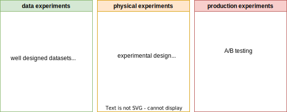
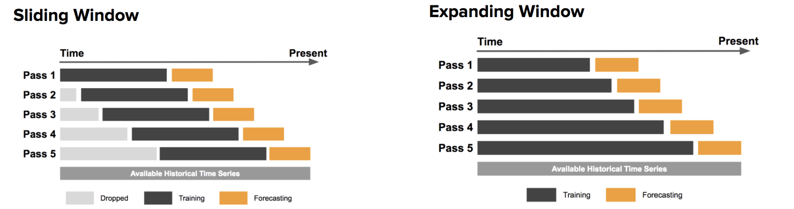
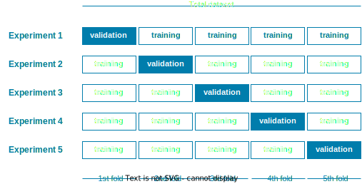
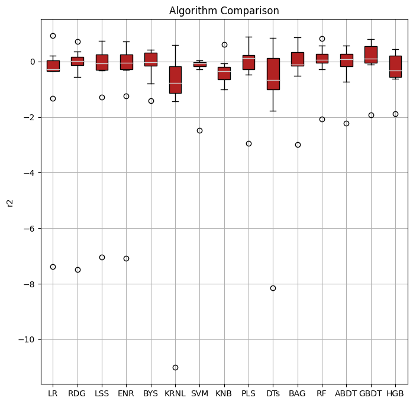
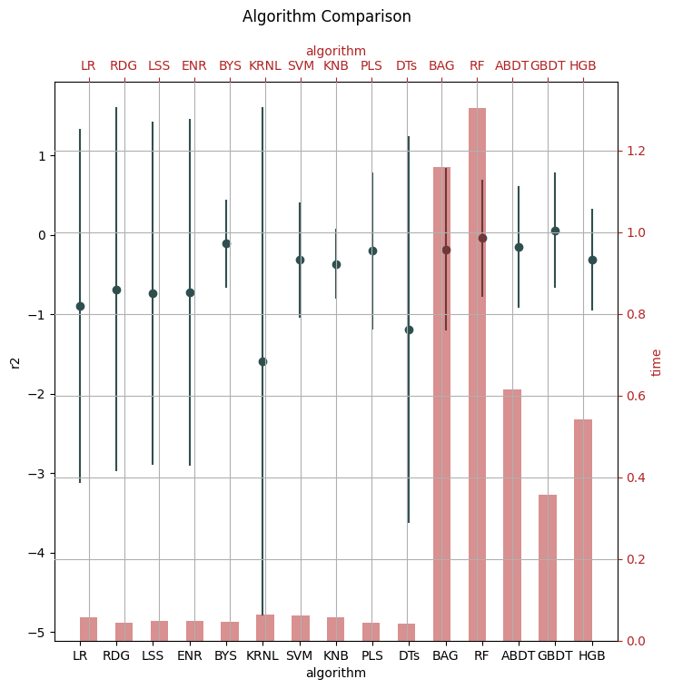
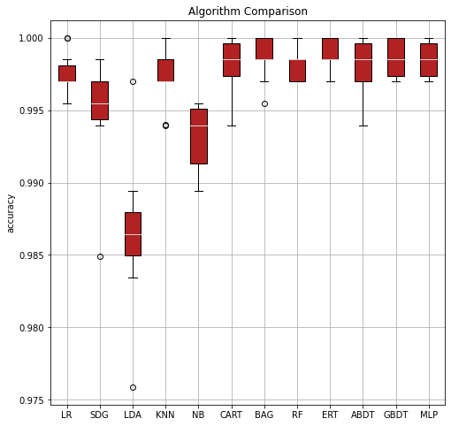
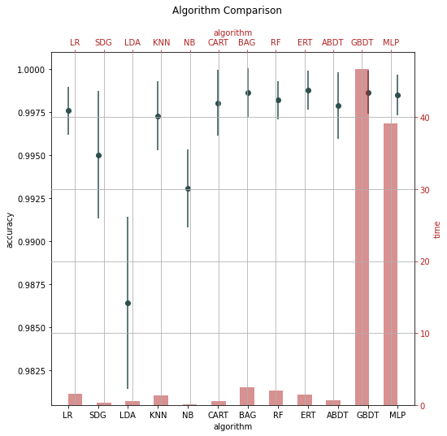
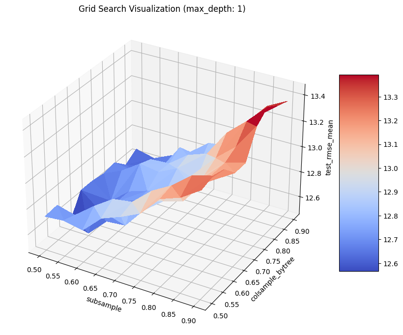
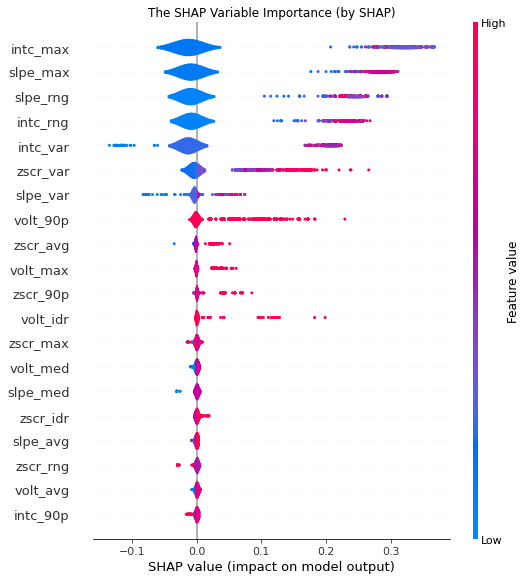

GossipCat Tutorials
*******************

Data Science Projects Basics
============================

Environment Setup
-----------------

The first step to start a data science project should always be setup a development file system, no matter on cloud or in your laptop. **GossipCat** provides a one-line command to setup a well-organized file system for data science projects.

.. code-block:: bash

    python -m gossipcat.dev.FileSys

The interactive and immersive command-line interfaces as following. Just type down your project name, like :code:`battery` in this tutorial. Then it will generate a file structure for your data science project and print out a file tree of it. 

::

    hi, there! please write down your machine learning project's name.
    project's name: battery
    project_battery/
        requirements.txt
        README.md
        .gitignore
        docs/
            READM.md
        log/
        model/
        test/
        data/
            tmp/
            train/
            test/
            result/
            raw/
        notebook/
        report/
        script/
            config.json
        deploy/
            deploy.sh

.. note::

    1. :file:`requirements.txt` includes all packages you need in your project. We recommend you to list not only package names but thier versions in the file. Besides, this serves your well if you develop your project on SageMaker, for you have to install all required packages every time restarting the Jupyter Notebook instance.
    2. :file:`.gitignore` includes :file:`data/*` by default, which is our best practice in data science projects with **git**. Generally, you don't want to git your data. 
    3. :file:`docs/READM.md` is inspired by `How to ML Paper - A brief Guide <https://docs.google.com/document/d/16R1E2ExKUCP5SlXWHr-KzbVDx9DBUclra-EbU8IB-iE/edit?usp=sharing>`_. We highly recommend you to document your data science project in an organized way so that anyone, including youself, can catch up your thoughts in the future.

Logging
-------

Most data scientists spend little time on logging and may just print out along the experiement in Jupyter Notebook. However, this can make annoying troubles when it comes to production environment or when the data science experiements require a long period to generate experiement records. Therefore, logging is critical to a data science project. 

Python Module **Logging** is one of the most underrated features. Two things (5&3) to take away from **Logging**: 

1. **5 levels** of importance that logs can contain(debug, info, warning, error, critical);  
2. **3 components** to configure a logger in Python (a logger, a formatter, and at least one handler).

**GossipCat** provides a function :code:`get_logger` to make life easier.

.. code-block:: Python

    import gossipcat as gc
    
    log_name = 'battery'
    log_file = '../log/batter.log'

    logger = gc.get_logger(logName=log_name, logFile=log_file)
    
    logger.debug('this is a debug')
    logger.info('this is a test')
    logger.warning('this is a warning')
    
    logger.error('this is an error!')
    logger.critial('this is critical!')

Data Science Experiment
=======================

Most problems in the industry are not crystal clear as data science or machine learning homework problems in school. Data scientists should work with other function teams closely to really understand the problem and try to figure out a practical way to solve it. AND it is not even necessary to be a data science or machine learning project –– **a data scientist is a problem solver first and can solve it with data science when necessary**.  

Even within data science, there are plenty of methods and algorithms to solve problems, which really depends on the **business** needs and **technique** feasibility. Also, this is where **creativity** happens. A good data scientist should be familiar with commonly used methods and able to pick up new methods if necessary to adapt to the needs both from business and technique.  

Leave the creative ones aside, **GossipCat** and this tutorial focus on commonly used methods, say classification and regression, to provide a quick start and to reduce repetitive work as much as possible. 

Experiement Design
------------------

We generally divide the experiments into three categories: **physical experiments, production experiments, and data experiments**. The traditional experiments like physics, chemistry, and biology are all physical experiments, which is most effective ones but also can cost much money and time compared to data experiments. Besides, the most impactful and expensive experiment is the one on production and generally is conducted with A/B testing. The data experiments are based on the data we have, not the data generated by physical experiments or online productions. 

Granularity 
~~~~~~~~~~~

Data granularity is a measure of the level of detail in a data structure. It is not always clear in the industrial scenarios and therefore is critical to problem solving.  

- **A temporal granularity** is a partition of the timeline. Each element of the partition is called granule, which can be used to provide information with a time qualification. 
- **A spatial granularity** is a partition of a space. A granule in the granularity represents a region of the partition. Each granule can be used to provide information with a spatial qualification. 
- **A spatio-temporal granularity** represents changes in time of a spatial granularity: it associates a space to time and can be used to provide information with a spatio-temporal qualification. 

In time-series data, for example, the granularity of measurement might be based on intervals of years, months, weeks, days, or hours. For ordering transactions, granularity might be at the purchase order level, or line item level, or detailed configuration level for customized parts.

Target
~~~~~~

For supervised machine learning, it seems to be clear that you got labels (or target, dependent variables) in your data set. While the target definition does not always inherently exist. For example, 

1. Price predicting: listing price or selling price? 
2. Non-performing loans classification: A nonperforming loan (NPL) is a sum of borrowed money whose scheduled payments have not been made by the debtor for a period –– usually 90 or 180 days. So, 90 or 180? Any tolerance periods? 

**Other than the physical world, things are always defined by people and therefore can be very different from time to time and from scenario to scenario. Things are always changing in the physical world as well. Before talking about any concepts abstractly, define them concretely.** This is a teamwork involving both business and technique teams.   

Data scientists should always double confirm with business team about the target definition. Furthermore, data scientists should always be skeptical of the definition especially when the training results are too good to be true. Check if there is any **data leakage** in the definition.  

.. note::

    **Data Leakage**: Data leakage (or leakage) happens when your training data contains information about the target, but similar data will not be available when the model is used for prediction. This leads to high performance on the training set (and possibly even the validation data), but the model will perform poorly in production.

    In other words, leakage causes a model to look accurate until you start making decisions with the model, and then the model becomes very inaccurate.

    There are two main types of leakage: **target leakage** and **train-test contamination**.
    
    `More information here. <https://www.kaggle.com/code/alexisbcook/data-leakage>`_

Features
~~~~~~~~

Features does **not** inherently exist for most data science projects; and that is why **feature engineering** is so critical that deciding the upper limit of the performance of the models. Alike the target design we talked above, the feature design or feature engineering involves more collaborations with business and tech sides. 

Generally speaking, one should consider three major ways to do feature engineering:

1. **Mathematics**: transformations of features (e.g. :math:`log(x)`, :math:`\sqrt{x}`, :math:`x^2`, etc.), discretize continuous features, decompose features (e.g., categorical, date/time, etc.), and aggregate features into promising new features. 
2. **Exploratory Data Analysis**: just play with the data, visualize data intuitively, without any model assumptions. 
3. **Domain Experts**: do research on the topics, go ask some domain experts. 

When designing a feature, you should always keep in mind that **a useful feature is the one that can distinguish postive samples from the negtive ones**. For example, in the dog-cat classification, the feature -- having a tail can never be a good feature to tell them apart, but the feature -- the way they sound can serve as a useful one. 

Time Window
~~~~~~~~~~~

Different than the dog-cat classification, most machine learning projects in business are related to time. We would like to predict or forecast something, of course in the future. So we should take the time into consideration when we design training datasets. Here comes the **Time Window**.

There are two major approaches: the **sliding window** approach and the **expanding window** approach. (Source: `Uber Engineering <https://www.uber.com/blog/forecasting-introduction/>`_ )

- **Sliding window**: In the sliding window approach, one uses a fixed size window, shown here in black, for training. Subsequently, the method is tested against the data shown in orange.

- **Expanding window**: On the other hand, the expanding window approach uses more and more training data, while keeping the testing window size fixed. The latter approach is particularly useful if there is a limited amount of data to work with.

It is also possible, and often best, to marry the two methods: start with the expanding window method and, when the window grows sufficiently large, switch to the sliding window method.

Cross Validation
~~~~~~~~~~~~~~~~

The vanila idea to test a model's perfomance is to split the data into training and test sets, while this can lead to a bais from the test set. So we have cross-validation, which gives a more accurate measure of model quality.

Modeling Design
---------------

Even the junior data scientists should be familiar with we include in the Modeling Design, since this is the most discussed part in school or any other courses about data science or machine learning. However, without the Experiment Design we just talked about above, the Modeling Design is meaningless. You can never achieve your destination with a wrong direction. 

Baseline
~~~~~~~~

It is very important to have a baseline whenever you start a machine learning project; and the baseline is even not neccessary to be a machine learning one.

    **Rule #1: Don’t be afraid to launch a product without machine learning.**
    
    Machine learning is cool, but it requires data. Theoretically, you can take data from a different problem and then tweak the model for a new product, but this will likely underperform basic heuristics. If you think that machine learning will give you a 100% boost, then a heuristic will get you 50% of the way there.

    For instance, if you are ranking apps in an app marketplace, you could use the install rate or number of installs as heuristics. If you are detecting spam, filter out publishers that have sent spam before. Don’t be afraid to use human editing either. If you need to rank contacts, rank the most recently used highest (or even rank alphabetically). If machine learning is not absolutely required for your product, don't use it until you have data.

The above **Rule #1** is given by `Goolge's Rules of Machine Learning <https://developers.google.com/machine-learning/guides/rules-of-ml#rule_1_don%E2%80%99t_be_afraid_to_launch_a_product_without_machine_learning>`_. 

Only when you have a baseline, all your efforts can be compared then. Otherwise, you may probably spend much time talking how fancy your model is while nobody knows what value you actually can contribute. 

Algorithm Comparison
~~~~~~~~~~~~~~~~~~~~

When you open any machine learning introduction book, you will find a buntch of algrithms. Here comes the question: which one is best for your project? 

    A model is a simplified version of the observations. The simplifications are meant to discard the superfluous details that are unlikely to generalize to new instances. To decide what data to discard and what data to keep, you must make assumptions.For example, a linear model makes the assumption that the data is fundamentally linear and that the distance between the instances and the straight line is just noise, which can safely be ignored.
    
    In a famous 1996 paper, David Wolpert demonstrated that if you make absolutely no assumption about the data, then there is no reason to prefer one model over any other. This is called the **No Free Lunch** (NFL) theorem. For some datasets the best model is a linear model, while for other datasets it is a neural network. There is no model that is a priori guaranteed to work better (hence the name of the theorem). The only way to know for sure which model is best is to evaluate them all. Since this is not possible, in practice you make some reasonable assumptions about the data and eval‐ uate only a few reasonable models. For example, for simple tasks you may evaluate linear models with various levels of regularization, and for a complex problem you may evaluate various neural networks.[HOML]

Our best strategy is to explore many different models and shortlist the best ones.

Here's an example for a regression task.

.. code-block:: Python

    import gossipcat as gc
    
    com = gc.lab.Comparison(df=df[feature+[target]], 
                            target=target, 
                            features=feature, 
                            metric='r2')
    
    com.visualize()

.. code-block:: Python

    com.visualize(time=True)

The algorithms included above can be found in `scikit-learn <https://scikit-learn.org/>`_.

======     =============================
Abbrev     Algorithm
======     =============================
LR         LinearRegression
RDG        Ridge
LSS        Lasso
ENR        ElasticNet
LAR        Lars
BYS        BayesianRidge
SDG        SGDRegressor
PAR        PassiveAggressiveRegressor
KRNL       KernelRidge
SVM        SVR
KNB        KNeighborsRegressor
GPR        GaussianProcessRegressor
PLS        PLSRegression
DTs        DecisionTreeRegressor
BAG        BaggingRegressor
RF         RandomForestRegressor
ABDT       AdaBoostRegressor
GBDT       GradientBoostingRegressor
HGB        HistGradientBoostingRegressor
======     =============================

The following is an example for a classification task.

.. code-block:: Python
    
    com = gc.lab.Comparison(df=df[feature+[target]], 
                            target=target, 
                            features=feature, 
                            metric='accuracy')
    
    com.visualize()

.. code-block:: Python

    com.visualize(time=True)

======     =============================
Abbrev     Algorithm
======     =============================
LR         LogisticRegression
SDG        SGDClassifier
LDA        LinearDiscriminantAnalysis
KNN        KNeighborsClassifier
NB         GaussianNB
CART       DecisionTreeClassifier
BAG        BaggingClassifier
RF         RandomForestClassifier
ERT        ExtraTreesClassifier
ABDT       AdaBoostClassifier
GBDT       GradientBoostingClassifier
MLP        MLPClassifier
======     =============================

.. note::
    
    It is clear that the ensembled tree-based models (Bagging, Random Forest, and Boosting) win in the above two examples. This is actually not a surprise to us.
    
    Tree Based models (like Random Forests), have been much better than Deep Learning/Neural Networks when it comes to analyzing **tabular data**. `Why do tree-based models still outperform deep learning on tabular data? <https://arxiv.org/abs/2207.08815>`_
    
    - **Reason 1**: Neural Nets are biased to overly smooth solutions.
    - **Reason 2**: Uninformative features affect more MLP-like NNs.
    - **Reason 3**: NNs are invariant to rotation. Actual Data is not.

Hyper-parameter Tuning
~~~~~~~~~~~~~~~~~~~~~~

A **hyper-parameter** is a parameter whose value is used **to control the learning process**. By contrast, the values of other parameters (typically node weights) are learned.

**GossipCat** provides hyper-parameter tuning for `XGBoost <https://xgboost.ai>`_. 

.. code-block:: Python

    search = gc.lab.GridSearch(df=df, 
                               target=target, 
                               features=features,
                               regression=True,
                               log_path=f_log)

    search.search(range_max_depth=range(1, 5, 1))

    search.get_log()

    search.visualize(max_depth=1)

  

Explanation
~~~~~~~~~~~

We recommend you use `SHAP <https://shap.readthedocs.io>`_ to explain your model, which is a game theoretic approach to explain the output of any machine learning model.

Model Development
=================

Model development and maintenance is under the MLOps topic, which is a quite new but fast-growing area in the data science field. As it is out of the scope of GossipCat, we will not cover much content here. For more information, you may refer to Ewen’s another package `BatCat <https://batcat.readthedocs.io/>`_.

Git
----

Git is a version control system designed to track changes in a source code over time.

When many people work on the same project without a version control system it's total chaos. Resolving the eventual conflicts becomes impossible as none has kept track of their changes and it becomes very hard to merge them into a single central truth. Git and higher-level services built on top of it (like Github) offer tools to overcome this problem.

Docker
------

Docker is a software container platform that provides an isolated container for us to have everything we need for our experiments to run. 

Essentially, it is a light-weight Virtual Machine (VM) built from a script that can be version controlled; so we can now version control our data science environment! Developers use Docker when collaborating on code with coworkers and they also use it to build agile software delivery pipelines to ship new features faster.
